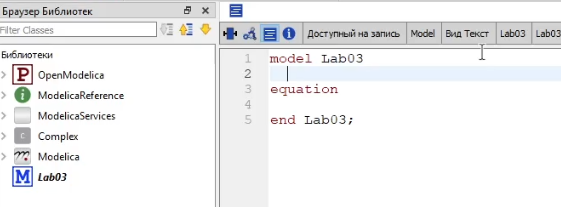
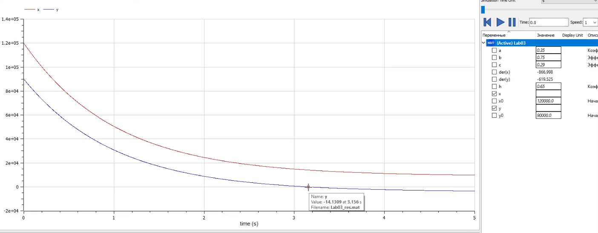
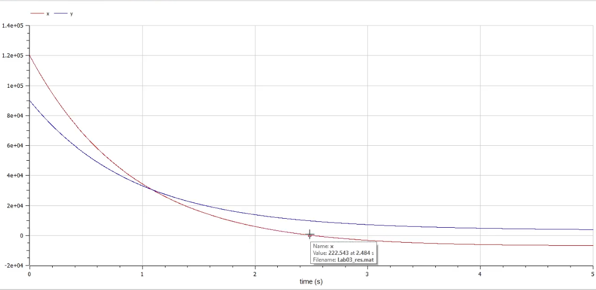
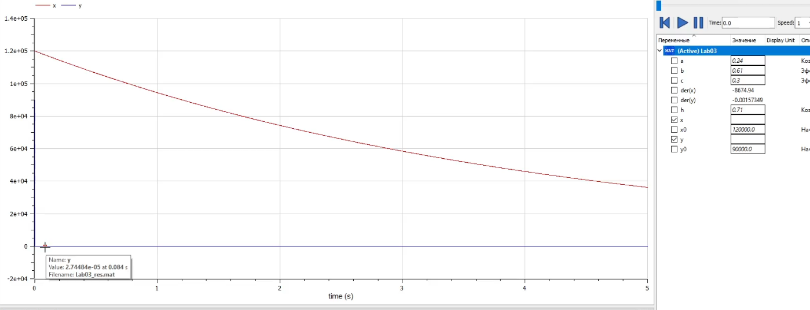
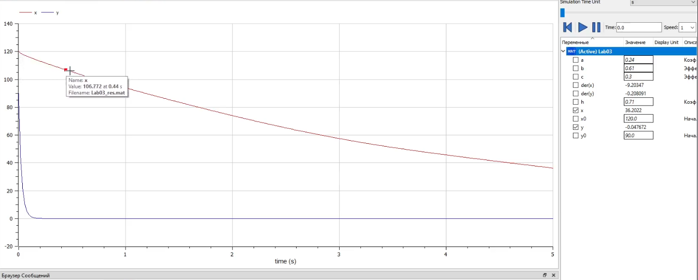

---
# Front matter
title: "Отчет по лаб. работе №3"
subtitle: "Модель боевых действий"
author: "Вейценфельд Даниил Анатольевич"

# Generic otions
lang: ru-RU
toc-title: "Содержание"

# Bibliography
bibliography: cite.bib
csl: ../../pandoc-cfg/GOST-R-7-0-5-2008.csl

# Pdf output format
toc: true # Table of contents
toc_depth: 2
lof: true # List of figures
lot: true # List of tables
fontsize: 12pt
linestretch: 1.5
papersize: a4
documentclass: scrreprt
## I18n
polyglossia-lang:
  name: russian
  options:
	- spelling=modern
	- babelshorthands=true
polyglossia-otherlangs:
  name: english
### Fonts
mainfont: PT Serif
romanfont: PT Serif
sansfont: PT Sans
monofont: PT Mono
mainfontoptions: Ligatures=TeX
romanfontoptions: Ligatures=TeX
sansfontoptions: Ligatures=TeX,Scale=MatchLowercase
monofontoptions: Scale=MatchLowercase,Scale=0.9
## Biblatex
biblatex: true
biblio-style: "gost-numeric"
biblatexoptions:
  - parentracker=true
  - backend=biber
  - hyperref=auto
  - language=auto
  - autolang=other*
  - citestyle=gost-numeric
## Misc options
indent: true
header-includes:
  - \linepenalty=10 # the penalty added to the badness of each line within a paragraph (no associated penalty node) Increasing the value makes tex try to have fewer lines in the paragraph.
  - \interlinepenalty=0 # value of the penalty (node) added after each line of a paragraph.
  - \hyphenpenalty=50 # the penalty for line breaking at an automatically inserted hyphen
  - \exhyphenpenalty=50 # the penalty for line breaking at an explicit hyphen
  - \binoppenalty=700 # the penalty for breaking a line at a binary operator
  - \relpenalty=500 # the penalty for breaking a line at a relation
  - \clubpenalty=150 # extra penalty for breaking after first line of a paragraph
  - \widowpenalty=150 # extra penalty for breaking before last line of a paragraph
  - \displaywidowpenalty=50 # extra penalty for breaking before last line before a display math
  - \brokenpenalty=100 # extra penalty for page breaking after a hyphenated line
  - \predisplaypenalty=10000 # penalty for breaking before a display
  - \postdisplaypenalty=0 # penalty for breaking after a display
  - \floatingpenalty = 20000 # penalty for splitting an insertion (can only be split footnote in standard LaTeX)
  - \raggedbottom # or \flushbottom
  - \usepackage{float} # keep figures where there are in the text
  - \floatplacement{figure}{H} # keep figures where there are in the text
---

# Цель работы

Изучить задачу о модели боевых действий.
Построить модель численности войск стран X и Y.
Сделать выводы

# Задание

**Вариант №9**

Между страной Х и страной У идет война. Численность состава войск
исчисляется от начала войны, и являются временными функциями `x(t)`
и `y(t)`.
В начальный момент времени страна Х имеет армию численностью 120 000 человек,
а в распоряжении страны У армия численностью в 90 000 человек. Для упрощения
модели считаем, что коэффициенты `a, b, c, h` постоянны. Также считаем
`P(t)` и `Q(t)` непрерывные функции.
Постройте графики изменения численности войск армии Х и армии У для
следующих случаев:
1. Модель боевых действий между регулярными войсками
$$
  \frac{dx}{dt} = - 0,35x(t) - 0,75y(t) + sin(t) + 1
$$
$$
  \frac{dy}{dt} = - 0,29x(t) - 0,65y(t) + cos(t) + 1
$$
2. Модель ведение боевых действий с участием регулярных войск и
партизанских отрядов
$$
  \frac{dx}{dt} = - 0,24x(t) - 0,61y(t) + sin(2t)
$$
$$
  \frac{dy}{dt} = - 0,3x(t)y(t) - 0,71y(t) + cos(3t)
$$

# Теоретическое введение

Рассмотрим некоторые простейшие модели боевых действий – модели
Ланчестера. В противоборстве могут принимать участие как регулярные войска,
так и партизанские отряды. В общем случае главной характеристикой соперников
являются численности сторон. Если в какой-то момент времени одна из
численностей обращается в нуль, то данная сторона считается проигравшей (при
условии, что численность другой стороны в данный момент положительна).

Рассмотрим три случая ведения боевых действий:
  1. Боевые действия между регулярными войсками
  2. Боевые действия с участием регулярных войск и партизанских отрядов
  3. Боевые действия между партизанскими отрядами
   
В первом случае численность регулярных войск определяется тремя
факторами:
- скорость уменьшения численности войск из-за причин, не связанных с боевыми действиями (болезни, травмы, дезертирство);
- скорость потерь, обусловленных боевыми действиями противоборствующих сторон (что связанно с качеством стратегии, уровнем вооружения, профессионализмом солдат и т.п.);
- скорость поступления подкрепления (задаётся некоторой функцией от времени).

В этом случае модель боевых действий между регулярными войсками
описывается следующим образом

$$
\frac{dx}{dt} = - a(t)x(t) - b(t)y(t) + P(t)
$$
$$
\frac{dy}{dt} = - c(t)x(t) - h(t)y(t) + Q(t)
$$
{ #for:001 }

Потери, не связанные с боевыми действиями, описывают члены `-a(t)x(t)` и
`-h(t)y(t)`, члены `-b(t)y(t)` и `-c(t)x(t)` отражают потери на поле боя.
Коэффициенты `b(t)` и `c(t)` указывают на эффективность боевых действий со
стороны `у` и `х` соответственно, a `a(t), h(t)` - величины, характеризующие степень
влияния различных факторов на потери. Функции `P(t), Q(t)` учитывают
возможность подхода подкрепления к войскам `Х` и `У` в течение одного дня.

Во втором случае в борьбу добавляются партизанские отряды. Нерегулярные
войска в отличии от постоянной армии менее уязвимы, так как действуют скрытно,
в этом случае сопернику приходится действовать неизбирательно, по площадям,
занимаемым партизанами. Поэтому считается, что тем потерь партизан,
проводящих свои операции в разных местах на некоторой известной территории,
пропорционален не только численности армейских соединений, но и численности
самих партизан. В результате модель принимает вид:

$$
\frac{dy}{dt} = - a(t)x(t) - b(t)y(t) + P(t)
$$
$$
\frac{dy}{dt} = - c(t)x(t)y(t) - h(t)y(t) + Q(t)
$$
{ #for:002 }

В этой системе все величины имею тот же смысл, что и в системе ([-@for:001])

# Выполнение лабораторной работы

1. Создал новую модель в OpenModelica (рис. [-@fig:001]).

{ #fig:001 width=70% }

2. Написал параметры для модели:
  ```m
  parameter Real x0 = 120000 "Начальная численность X";
  parameter Real y0 = 90000 "Начальная численность Y";
  parameter Real a = 0.35 "Коэфф. собств. потерь X";
  parameter Real h = 0.65 "Коэфф. собств. потерь Y";
  parameter Real c = 0.29 "Эффективность X";
  parameter Real b = 0.75 "Эффективность Y";
  ```

3. Написал уравнения для модели. Модель стала выглядеть вот так:
  ```m
  model Lab03
    parameter Real x0 = 120000 "Начальная численность X";
    parameter Real y0 = 90000 "Начальная численность Y";
    parameter Real a = 0.35 "Коэфф. собств. потерь X";
    parameter Real h = 0.65 "Коэфф. собств. потерь Y";
    parameter Real c = 0.29 "Эффективность X";
    parameter Real b = 0.75 "Эффективность Y";
    
    Real x(start=x0), y(start=y0);
    
  equation
    der(x) = - a * x - b * y + sin(time) + 1;
    der(y) = - c * x - h * y + cos(time) + 1;
    
  end Lab03;
  ```

4. Запустил симуляцию модели. По графику видно, что примерно на момент
  времени `t = 3.15`, войска у армии y закончились, следовательно Y проиграла войну (рис. [-@fig:002]).

{ #fig:002 width=70% }

5. Для эксперимента повысил коэффициенты эффективности Y и собственных потерь 
  X. Теперь армия Х проигрывает примерно на `t = 2.49`, опережая Y по потерям
  примерно на `t = 1.12` (рис. [-@fig:003]).

{ #fig:003 width=70% }

6. Далее нужно построить модель с участием партизанских войск.
  ```m
  model Lab03
    parameter Real x0 = 120000 "Начальная численность X";
    parameter Real y0 = 90000 "Начальная численность Y";
    parameter Real a = 0.24 "Коэфф. собств. потерь X";
    parameter Real h = 0.71 "Коэфф. собств. потерь Y";
    parameter Real c = 0.3 "Эффективность X";
    parameter Real b = 0.61 "Эффективность Y";
    
    Real x(start=x0), y(start=y0);
    
  equation
    der(x) = - a * x - b * y + sin(2 * time);
    der(y) = - c * x * y - h * y + cos(3 * time);
    
  end Lab03;
  ```

7. Здесь уже не все однозначно. На графике явно видно, что армия Y
  сразу же проигрывает (рис. [-@fig:004]).

{ #fig:004 width=70% }

8. После проверок на большем количестве интервалов симуляции и подставлением
  различных значений в коэффициенты, я пришел к выводу, что это нормальное
  поведение модели. 
  Что бы в этом убедиться, я уменьшил масштаб численности до сотен. 
  На графике стало видно, что численность Y быстро падает до нуля в начале, 
  а падение армии X (производная графика X) уменьшается примерно 
  в два раза за это время (рис. [-@fig:005]).

{ #fig:005 width=70% }


# Выводы

Построил модель боевых действий.
Выводы по модели:
- Победа одной из сторон зависит от численности и эффективности войск:
  для борьбы с вдвое более многочисленным противником нужна в 
  четыре раза более эффективная армия, с втрое более 
  многочисленным - в девять раз и т. д.
- Сражение против партизанских отрядов губительно, каким бы не было
 превосходство в численности

# Список литературы{.unnumbered}

::: {#refs}
:::