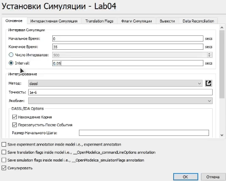
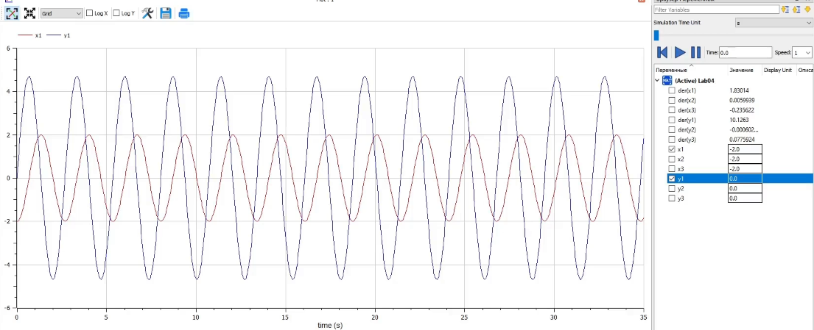
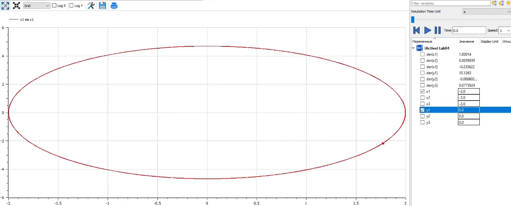
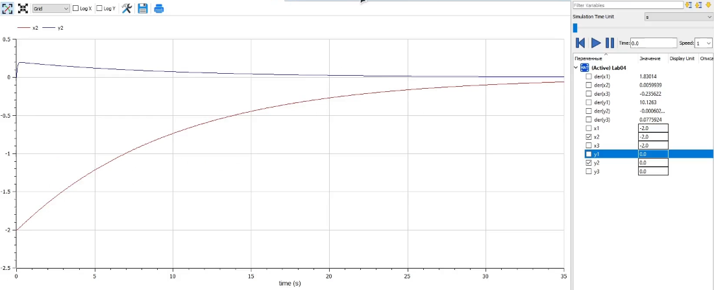
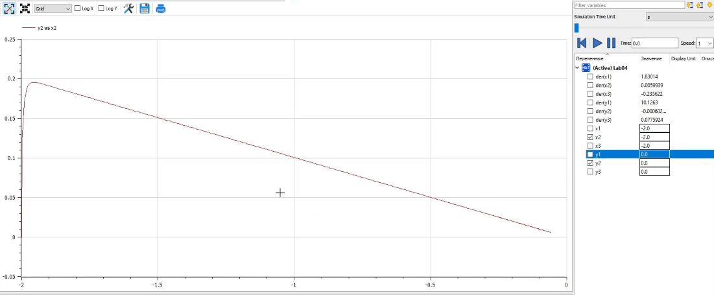
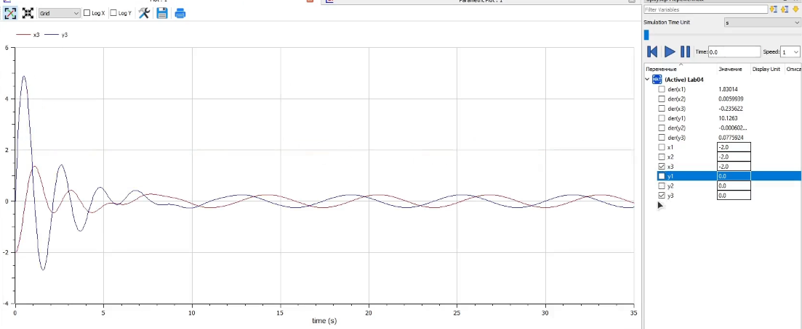
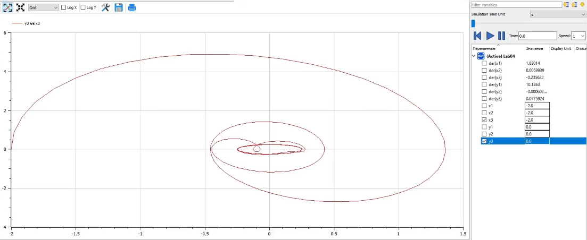

---
# Front matter
title: "Отчет по лаб. работе №4"
subtitle: "Модель боевых действий"
author: "Вейценфельд Даниил Анатольевич"

# Generic otions
lang: ru-RU
toc-title: "Содержание"

# Bibliography
bibliography: cite.bib
csl: ../../pandoc-cfg/GOST-R-7-0-5-2008.csl

# Pdf output format
toc: true # Table of contents
toc_depth: 2
lof: true # List of figures
lot: true # List of tables
fontsize: 12pt
linestretch: 1.5
papersize: a4
documentclass: scrreprt
## I18n
polyglossia-lang:
  name: russian
  options:
	- spelling=modern
	- babelshorthands=true
polyglossia-otherlangs:
  name: english
### Fonts
mainfont: PT Serif
romanfont: PT Serif
sansfont: PT Sans
monofont: PT Mono
mainfontoptions: Ligatures=TeX
romanfontoptions: Ligatures=TeX
sansfontoptions: Ligatures=TeX,Scale=MatchLowercase
monofontoptions: Scale=MatchLowercase,Scale=0.9
## Biblatex
biblatex: true
biblio-style: "gost-numeric"
biblatexoptions:
  - parentracker=true
  - backend=biber
  - hyperref=auto
  - language=auto
  - autolang=other*
  - citestyle=gost-numeric
## Misc options
indent: true
header-includes:
  - \linepenalty=10 # the penalty added to the badness of each line within a paragraph (no associated penalty node) Increasing the value makes tex try to have fewer lines in the paragraph.
  - \interlinepenalty=0 # value of the penalty (node) added after each line of a paragraph.
  - \hyphenpenalty=50 # the penalty for line breaking at an automatically inserted hyphen
  - \exhyphenpenalty=50 # the penalty for line breaking at an explicit hyphen
  - \binoppenalty=700 # the penalty for breaking a line at a binary operator
  - \relpenalty=500 # the penalty for breaking a line at a relation
  - \clubpenalty=150 # extra penalty for breaking after first line of a paragraph
  - \widowpenalty=150 # extra penalty for breaking before last line of a paragraph
  - \displaywidowpenalty=50 # extra penalty for breaking before last line before a display math
  - \brokenpenalty=100 # extra penalty for page breaking after a hyphenated line
  - \predisplaypenalty=10000 # penalty for breaking before a display
  - \postdisplaypenalty=0 # penalty for breaking after a display
  - \floatingpenalty = 20000 # penalty for splitting an insertion (can only be split footnote in standard LaTeX)
  - \raggedbottom # or \flushbottom
  - \usepackage{float} # keep figures where there are in the text
  - \floatplacement{figure}{H} # keep figures where there are in the text
---

# Цель работы

Построить модель гармонических колебаний (гармонического осцилятора)

# Задание

**Вариант №9**

1. Прописать уравнения для построения моделей гармонических колебаний при условии, что $x_0 = -2$, $y_0 = 0$, а интервал времени колебаний принимает значения $[0;35]$.

2. Построить фазовый портрет гармонического осциллятора для модели колебаний без затуханий и без действий внешней силы.

3. Построить фазовый портрет гармонического осциллятора для модели колебаний с затуханием и без действий внешней силы.

4. Построить фазовый портрет гармонического осциллятора для модели колебаний с затуханием и под действием внешней силы.

# Теоретическое введение

Движение грузика на пружинке, маятника, заряда в электрическом контуре, а
также эволюция во времени многих систем в физике, химии, биологии и других
науках при определенных предположениях можно описать одним и тем же
дифференциальным уравнением, которое в теории колебаний выступает в качестве
основной модели. Эта модель называется линейным гармоническим осциллятором.

Уравнение свободных колебаний гармонического осциллятора имеет
следующий вид:

$$
\ddot{x} + 2 \gamma \dot{x} + \omega^{2}_{0} x = 0
$$
(1)

где $x$ – переменная, описывающая состояние системы (смещение грузика, заряд
конденсатора и т.д.), $\gamma$ – параметр, характеризующий потери энергии (трение в
механической системе, сопротивление в контуре), $\omega_{0}$– собственная частота
колебаний, t – время.

Уравнение (1) есть линейное однородное дифференциальное уравнение
второго порядка и оно является примером линейной динамической системы.

При отсутствии потерь в системе ($\gamma = 0$) вместо уравнения (1.1) получаем
уравнение консервативного осциллятора энергия колебания которого сохраняется
во времени.

$$
\ddot{x} + \omega^{2}_{0} x = 0
$$
(2)

Для однозначной разрешимости уравнения второго порядка (2) необходимо
задать два начальных условия вида

$$\left\{ 
\begin{array}{c}
x(t_0) = x_0 \\ 
\dot{x}(t_0) = y_0 \\ 
\end{array}
\right.
$$
(3)

Уравнение второго порядка (2) можно представить в виде системы двух
уравнений первого порядка:

$$\left\{ 
\begin{array}{c}
\dot x = y \\ 
\dot y = \omega^{2}_{0} x \\ 
\end{array}
\right.
$$
(4)

Начальные условия (3) для системы (4) примут вид:
$$\left\{ 
\begin{array}{c}
x(t_0) = x_0 \\ 
y(t_0) = y_0 \\ 
\end{array}
\right.
$$
(5)

Независимые переменные x, y определяют пространство, в котором
«движется» решение. Это фазовое пространство системы, поскольку оно двумерно
будем называть его фазовой плоскостью.

Значение фазовых координат x, y в любой момент времени полностью
определяет состояние системы. Решению уравнения движения как функции
времени отвечает гладкая кривая в фазовой плоскости. Она называется фазовой
траекторией. Если множество различных решений (соответствующих различным
начальным условиям) изобразить на одной фазовой плоскости, возникает общая
картина поведения системы. Такую картину, образованную набором фазовых
траекторий, называют фазовым портретом.

# Выполнение лабораторной работы

1. Создал новую модель в OpenModelica.

2. Построил модели колебаний гармонического осциллятора:
  ```m
  model Lab04
    Real x1(start = -2);
    Real y1(start = 0);
    
    Real x2(start = -2);
    Real y2(start = 0);
    
    Real x3(start = -2);
    Real y3(start = 0);
    
  equation
    der(x1) = y1;
    der(y1) + 5.5 * x1 = 0;
    
    der(x2) = y2;
    der(y2) + 20 * y2 + 2 * x2 = 0;
    
    der(x3) = y3;
    der(y3) + y3 + 9 * x3 = 2 * sin(time);
    
  end Lab04;
  ```
  Где каждое из этих уравнений отражает:
    1. Модель без затуханий и действий внешний силы
    2. Модель с затуханием и без действий внешний силы
    3. Модель с затуханием и под действием внешний силы

4. Запустил симуляцию модели с установленным интервалом (рис. [-@fig:001]).
   
   { #fig:001 width=70% }
   
5. Получил результаты для первой модели (рис. [-@fig:002], [-@fig:003]).
   
   { #fig:002 width=70% }
   
   { #fig:003 width=70% }

6. Получил результаты для второй модели (рис. [-@fig:004], [-@fig:005]).
   
   { #fig:004 width=70% }

   { #fig:005 width=70% }

7. Получил результаты для третий модели (рис. [-@fig:006], [-@fig:007]).
   
   { #fig:006 width=70% }

   { #fig:007 width=70% }


# Выводы

Построил модель гармонических колебаний на примере задачи колебаний гармонического осциллятора. 
Получил дифференциальные уравнения для построения модели на заданном временном промежутке с учетом начального состояния системы.
Решили уравнения и построили фазовый портрет гармонического осциллятора для случая, когда колебания проходят без затуханий и без действий внешней силы, для случая, когда колебания проходят с затуханием и без действий внешней силы, а также для случая, когда колебания проходят с затуханием и под действием внешней силы.

# Список литературы{.unnumbered}

::: {#refs}
:::