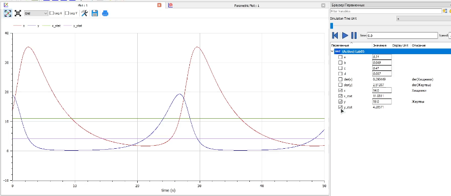
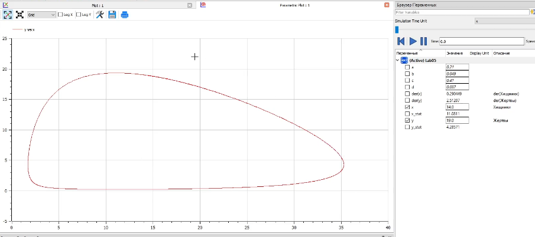
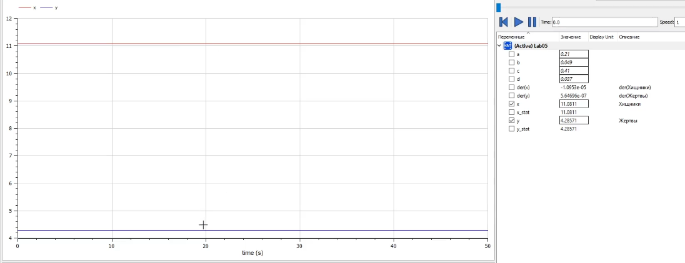

---
# Front matter
title: "Отчет по лаб. работе №4"
subtitle: "Модель боевых действий"
author: "Вейценфельд Даниил Анатольевич"

# Generic otions
lang: ru-RU
toc-title: "Содержание"

# Bibliography
bibliography: cite.bib
csl: ../../pandoc-cfg/GOST-R-7-0-5-2008.csl

# Pdf output format
toc: true # Table of contents
toc_depth: 2
lof: true # List of figures
lot: true # List of tables
fontsize: 12pt
linestretch: 1.5
papersize: a4
documentclass: scrreprt
## I18n
polyglossia-lang:
  name: russian
  options:
	- spelling=modern
	- babelshorthands=true
polyglossia-otherlangs:
  name: english
### Fonts
mainfont: PT Serif
romanfont: PT Serif
sansfont: PT Sans
monofont: PT Mono
mainfontoptions: Ligatures=TeX
romanfontoptions: Ligatures=TeX
sansfontoptions: Ligatures=TeX,Scale=MatchLowercase
monofontoptions: Scale=MatchLowercase,Scale=0.9
## Biblatex
biblatex: true
biblio-style: "gost-numeric"
biblatexoptions:
  - parentracker=true
  - backend=biber
  - hyperref=auto
  - language=auto
  - autolang=other*
  - citestyle=gost-numeric
## Misc options
indent: true
header-includes:
  - \linepenalty=10 # the penalty added to the badness of each line within a paragraph (no associated penalty node) Increasing the value makes tex try to have fewer lines in the paragraph.
  - \interlinepenalty=0 # value of the penalty (node) added after each line of a paragraph.
  - \hyphenpenalty=50 # the penalty for line breaking at an automatically inserted hyphen
  - \exhyphenpenalty=50 # the penalty for line breaking at an explicit hyphen
  - \binoppenalty=700 # the penalty for breaking a line at a binary operator
  - \relpenalty=500 # the penalty for breaking a line at a relation
  - \clubpenalty=150 # extra penalty for breaking after first line of a paragraph
  - \widowpenalty=150 # extra penalty for breaking before last line of a paragraph
  - \displaywidowpenalty=50 # extra penalty for breaking before last line before a display math
  - \brokenpenalty=100 # extra penalty for page breaking after a hyphenated line
  - \predisplaypenalty=10000 # penalty for breaking before a display
  - \postdisplaypenalty=0 # penalty for breaking after a display
  - \floatingpenalty = 20000 # penalty for splitting an insertion (can only be split footnote in standard LaTeX)
  - \raggedbottom # or \flushbottom
  - \usepackage{float} # keep figures where there are in the text
  - \floatplacement{figure}{H} # keep figures where there are in the text
---

# Цель работы

Построить модель хищник-жертва. Найти стационарное состояние системы.

# Задание

**Вариант №9**

$$
\left\{
\begin{array}{c}
\dot{x} = -0.21x(t) + 0.049x(t)y(t) \\ 
\dot{y} =  0.41y(t) - 0.037x(t)y(t)\\ 
\end{array}
\right.
$$

Постройте график зависимости численности хищников от численности жертв,
а также графики изменения численности хищников и численности жертв при
следующих начальных условиях:
$x_0 = 14, y_0 = 19$. Найдите стационарное состояние системы.

# Теоретическое введение

Простейшая модель взаимодействия двух видов типа «хищник — жертва» -
модель Лотки-Вольтерры. Данная двувидовая модель основывается на
следующих предположениях:
1. Численность популяции жертв x и хищников y зависят только от времени
(модель не учитывает пространственное распределение популяции на
занимаемой территории)
2. В отсутствии взаимодействия численность видов изменяется по модели
Мальтуса, при этом число жертв увеличивается, а число хищников падает
3. Естественная смертность жертвы и естественная рождаемость хищника
считаются несущественными
4. Эффект насыщения численности обеих популяций не учитывается
5. Скорость роста численности жертв уменьшается пропорционально
численности хищников

$$
\left\{
\begin{array}{c}
\frac{dx}{dt} = ax(t) - bx(t)y(t) \\ 
\frac{dy}{dt} = -cy(t) + dx(t)y(t)\\ 
\end{array}
\right.
$$
(1)

В этой модели $x$ – число жертв, $y$ - число хищников. Коэффициент a
описывает скорость естественного прироста числа жертв в отсутствие хищников, с
- естественное вымирание хищников, лишенных пищи в виде жертв. Вероятность
взаимодействия жертвы и хищника считается пропорциональной как количеству
жертв, так и числу самих хищников ($xy$). Каждый акт взаимодействия уменьшает
популяцию жертв, но способствует увеличению популяции хищников (члены $-bxy$
и $dxy$ в правой части уравнения).

Математический анализ этой (жесткой) модели показывает, что имеется
стационарное состояние, всякое же другое начальное состояние
приводит к периодическому колебанию численности как жертв, так и хищников,
так что по прошествии некоторого времени система возвращается в состояние B.
Стационарное состояние системы (1) (положение равновесия, не зависящее
от времени решение) будет в точке: $x_0 = \frac{c}{d}, y_0 = \frac{a}{b}$. Если начальные значения задать в стационарном состоянии
$x(0) = x_0, y(0) = y_0$, то в любой момент времени
численность популяций изменяться не будет. При малом отклонении от положения
равновесия численности как хищника, так и жертвы с течением времени не
возвращаются к равновесным значениям, а совершают периодические колебания
вокруг стационарной точки. Амплитуда колебаний и их период определяется
начальными значениями численностей $x(0), y(0)$. Колебания совершаются в
противофазе

# Выполнение лабораторной работы

1. Создал новую модель в OpenModelica.

2. Построил модель хищник-жертва с заданными параметрами:
  ```m
  model Lab05
    parameter Real a = 0.21;
    parameter Real b = 0.049;
    parameter Real c = 0.41;
    parameter Real d = 0.037;
      
    Real x(start = 14) "Хищники";
    Real y(start = 19) "Жертвы";
    
    Real x_stat;
    Real y_stat;

  equation
    der(x) = - a * x + b * x * y;
    der(y) = c * y - d * x * y;
    
    x_stat = c / d;
    y_stat = a / b;
  end Lab05;
  ```
  `x_stat` и `y_stat` будут отражать точку стационарного состояния системы

3. Запустил симуляцию (рис. [-@fig:001], [-@fig:002]).
  
  { #fig:001 width=70% }
  
  { #fig:002 width=70% }

4. Значение точки стационарного состояния системы - `(11.0811, 4.28571)`.
  Проверил эту точку (рис. [-@fig:003]). Точка рассчитана верно, система стационарна при таком началоном значении.
  
  { #fig:003 width=70% }

# Выводы

Построил модель хищник-жертва. Нашел стационарное состояние системы.

# Список литературы{.unnumbered}

::: {#refs}
:::