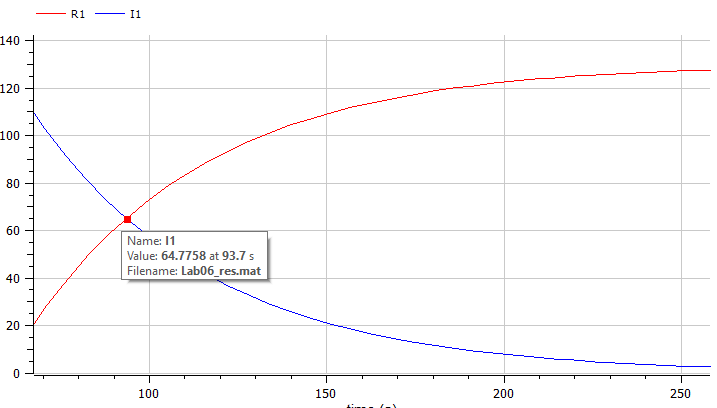
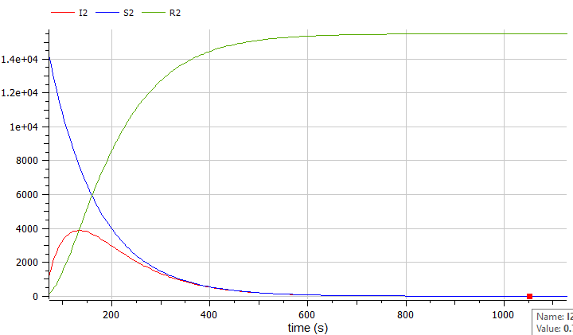

---
# Front matter
title: "Отчет по лаб. работе №4"
subtitle: "Модель боевых действий"
author: "Вейценфельд Даниил Анатольевич"

# Generic otions
lang: ru-RU
toc-title: "Содержание"

# Bibliography
bibliography: cite.bib
csl: ../../pandoc-cfg/GOST-R-7-0-5-2008.csl

# Pdf output format
toc: true # Table of contents
toc_depth: 2
lof: true # List of figures
lot: true # List of tables
fontsize: 12pt
linestretch: 1.5
papersize: a4
documentclass: scrreprt
## I18n
polyglossia-lang:
  name: russian
  options:
	- spelling=modern
	- babelshorthands=true
polyglossia-otherlangs:
  name: english
### Fonts
mainfont: PT Serif
romanfont: PT Serif
sansfont: PT Sans
monofont: PT Mono
mainfontoptions: Ligatures=TeX
romanfontoptions: Ligatures=TeX
sansfontoptions: Ligatures=TeX,Scale=MatchLowercase
monofontoptions: Scale=MatchLowercase,Scale=0.9
## Biblatex
biblatex: true
biblio-style: "gost-numeric"
biblatexoptions:
  - parentracker=true
  - backend=biber
  - hyperref=auto
  - language=auto
  - autolang=other*
  - citestyle=gost-numeric
## Misc options
indent: true
header-includes:
  - \linepenalty=10 # the penalty added to the badness of each line within a paragraph (no associated penalty node) Increasing the value makes tex try to have fewer lines in the paragraph.
  - \interlinepenalty=0 # value of the penalty (node) added after each line of a paragraph.
  - \hyphenpenalty=50 # the penalty for line breaking at an automatically inserted hyphen
  - \exhyphenpenalty=50 # the penalty for line breaking at an explicit hyphen
  - \binoppenalty=700 # the penalty for breaking a line at a binary operator
  - \relpenalty=500 # the penalty for breaking a line at a relation
  - \clubpenalty=150 # extra penalty for breaking after first line of a paragraph
  - \widowpenalty=150 # extra penalty for breaking before last line of a paragraph
  - \displaywidowpenalty=50 # extra penalty for breaking before last line before a display math
  - \brokenpenalty=100 # extra penalty for page breaking after a hyphenated line
  - \predisplaypenalty=10000 # penalty for breaking before a display
  - \postdisplaypenalty=0 # penalty for breaking after a display
  - \floatingpenalty = 20000 # penalty for splitting an insertion (can only be split footnote in standard LaTeX)
  - \raggedbottom # or \flushbottom
  - \usepackage{float} # keep figures where there are in the text
  - \floatplacement{figure}{H} # keep figures where there are in the text
---

# Цель работы

Построить модель эпидемии для двух случаев. Проанализировать результаты.

# Задание

**Вариант №9**

На одном острове вспыхнула эпидемия. Известно, что из всех проживающих
на острове ($N = 15 500$) в момент начала эпидемии ($t=0$) число заболевших людей
(являющихся распространителями инфекции) $I(0)=115$, А число здоровых людей с
иммунитетом к болезни $R(0)=15$. Таким образом, число людей восприимчивых к
болезни, но пока здоровых, в начальный момент времени $S(0)=N-I(0)- R(0)$.
Постройте графики изменения числа особей в каждой из трех групп.
Рассмотрите, как будет протекать эпидемия в случае:
1) если $I(0) \le I^*$
2) если $I(0) > I^*$

# Теоретическое введение [1]

Рассмотрим простейшую модель эпидемии. Предположим, что некая
популяция, состоящая из $N$ особей, (считаем, что популяция изолирована)
подразделяется на три группы. Первая группа - это восприимчивые к болезни, но
пока здоровые особи, обозначим их через $S(t)$. Вторая группа – это число
инфицированных особей, которые также при этом являются распространителями
инфекции, обозначим их $I(t)$. А третья группа, обозначающаяся через $R(t)$ – 
это здоровые особи с иммунитетом к болезни.

До того, как число заболевших не превышает критического значения $I^*$, 
считаем, что все больные изолированы и не заражают здоровых. Когда
$I(t) > I^*$, тогда инфицирование способны заражать восприимчивых к болезни
особей. Таким образом, скорость изменения числа $S(t)$ меняется по
следующему закону:

$$
\frac{dS}{dt} = 
\left\{ 
\begin{array}{c}
- \alpha S, I(t) > i^* \\ 
0, I(t) \le i^* \\ 
\end{array}
\right.
$$
(1)

Поскольку каждая восприимчивая к болезни особь, которая, в конце концов,
заболевает, сама становится инфекционной, то скорость изменения числа
инфекционных особей представляет разность за единицу времени между
заразившимися и теми, кто уже болеет и лечится, т.е.:

$$
\frac{dI}{dt} = 
\left\{ 
\begin{array}{c}
\alpha S - \beta I, I(t) > i^* \\ 
- \beta I, I(t) \le i^* \\ 
\end{array}
\right.
$$
(2)

А скорость изменения выздоравливающих особей (при этом приобретающие
иммунитет к болезни)

$$
\frac{dR}{dt} = \beta I
$$
(3)

Постоянные пропорциональности
$\alpha, \beta$, - это коэффициенты заболеваемости
и выздоровления соответственно.

Для того, чтобы решения соответствующих уравнений определялось
однозначно, необходимо задать начальные условия. Считаем, что на начало
эпидемии в момент времени $t=0$ нет особей с иммунитетом к болезни $R(0)=0$, а
число инфицированных и восприимчивых к болезни особей
$I(0)$ и $S(0)$ соответственно. Для анализа картины протекания эпидемии 
необходимо рассмотреть два случая: $I(0) \le I^*$ и $I(0) > I^*$

# Выполнение лабораторной работы

1. Создал новую модель в OpenModelica [2].

2. Построил модель эпидемии с заданными параметрами [3]:
  ```m
  model Lab06
    parameter Real N = 15500;
    parameter Real I0 = 115;
    parameter Real R0 = 15;
    parameter Real S0 = N - I0 - R0;
    
    parameter Real a = 0.01;
    parameter Real b = 0.02;
    
    Real I1(start = I0);
    Real R1(start = R0);
    Real S1(start = S0);
    Real I2(start = I0);
    Real R2(start = R0);
    Real S2(start = S0);

  equation
    der(S1) = 0;
    der(I1) = - b * I1;
    der(R1) = b * I1;
    
    der(S2) = - a * S2;
    der(I2) = a * S2 - b * I2;
    der(R2) = b * I2;
  end Lab06;
  ```
  Где рассмотрены два случая: начальное количество заболевших меньше, чем число, при котором изоляция не помогает, и обратный этому случай.

2. Выполнил симуляцию. Рассмотрел первый случай (рис. [-@fig:001]). Чсло людей, которых не 
  коснулась болезнь в первом случае не изменяется; вывел график только 
  инфецированных и имеющих иммунитет. На графике видно, как число зараженных становится меньше выздоровевших примерно на 65 секунде.

  { #fig:001 width=70% }

3. Рассмотрел второй случай (рис. [-@fig:002]). В нем все группы людей изменяются. Группа тех, 
  кого не коснулась болезнь - стремится к нулю. Кол-во инфецированных сначала 
  растет, но затем падает. Кол-во выздоровевших уже примерно на 120-й секунде 
  обогнало кол-во зараженных. Все население получило имуннитет примерно на 
  1050-й секунде.

{ #fig:002 width=70% }

# Выводы

Построил модель эпидемии. Изучил результаты, объяснил происходящее на графиках.

# Список литературы{.unnumbered}

1. RUDN. Методические пособия по курсу Математическое Моделирование. — 2022.
2. OpenModelica Documentation. — 2022. — Access mode: https://www.openmodelica.org/.
3. Modelica Documentation. — 2022. — Access mode: https://build.openmodelica.org/Documentation/index.html.
