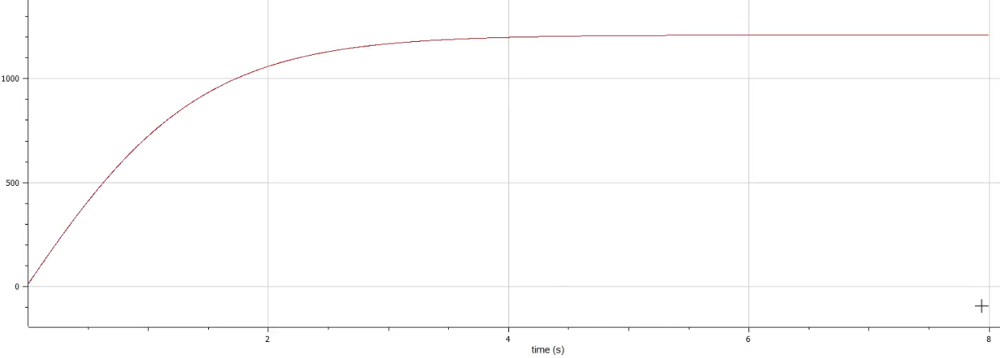

<style>
section.titleslide h6
{
    text-align: right;
}
section.titleslide
{
    text-align: center;
}
</style>

<!-- _class: titleslide -->

#### РОССИЙСКИЙ УНИВЕРСИТЕТ ДРУЖБЫ НАРОДОВ
#### Факультет физико-математических и естественных наук  
#### Кафедра прикладной информатики и теории вероятностей 
#### ПРЕЗЕНТАЦИЯ ПО ЛАБОРАТОРНОЙ РАБОТЕ №7
#### "Модель эффективности рекламы"

###### дисциплина: Математическое моделирование
###### Преподователь: Кулябов Дмитрий Сергеевич
###### Студент: Вейценфельд Даниил Анатольевич
###### Группа: НФИбд-01-19
МОСКВА
2022 г.

---

# **Структура**

- Теоретическое введение
- Работа в OpenModelica

---

# **Цель работы**

Построение модели эффективности рекламы

---

# **Задачи для выполнения лабораторной работы**

Постройте график распространения рекламы, математическая модель которой описывается следующим уравнением

1. $\frac{dn}{dt} = (0.7 + 0.00051 n(t))(N - n(t))$

2. $\frac{dn}{dt} = (0.00004 + 0.75 (t)n(t))(N - n(t))$

3. $\frac{dn}{dt} = (0.75 sin(0.5t) + 0.35cos(0.6t)n(t))(N - n(t))$


При этом объем аудитории $N = 1210$, в начальный момент о товаре знает $13$ 
человек. Для случая 2 определите в какой момент времени скорость 
распространения рекламы будет иметь максимальное значение.

---

# **Модель эфективности рекламы**

$$
\frac{dn}{dt} = (\alpha_1(t) + \alpha_2(t)n(t))(N - n(t))
$$
- $\alpha_1(t) > 0$ - 
  характеризует интенсивность рекламной кампании
- $\alpha_2(t) > 0$ - 
  влияние "сарафанного радио"
- $n(t)$ - кол-во покупателей продукта
- $N$ - общее кол-во (целевое) потенциальных покупателей

---

# **Выполнение лабораторной работы**

Была построена модель с тремя описанными ранее случаями:

```m
model Lab07
  parameter Real N = 1210;
  parameter Real n0 = 13; 

  Real n1(start = n0);
  Real n2(start = n0);
  Real n3(start = n0);

equation
  der(n1) = (0.7 + 0.00051 * n1) * (N - n1);
  der(n2) = (0.00004 + 0.75 * n2) * (N - n2);
  der(n3) = (0.75 * sin(0.5 * time) + 0.35 * cos(0.6 * time) * n3) * (N - n3);

end Lab07;
```

---

И выведены графики для всех случаев:



---


---


---

Для нахождения максимальной скорости притока покупателей, необходимо вывести
график производной по n:


Была найдена максимальная скорость $\frac{dn}{dt} = 274518$ в точке $t = 0.0049875$

---

# Выводы

Была построена модель распространения информации о товаре с учетом платной рекламы 
и с учетом сарафанного радио. 
Определен максимальный рост клиентов в одном из случаев.
