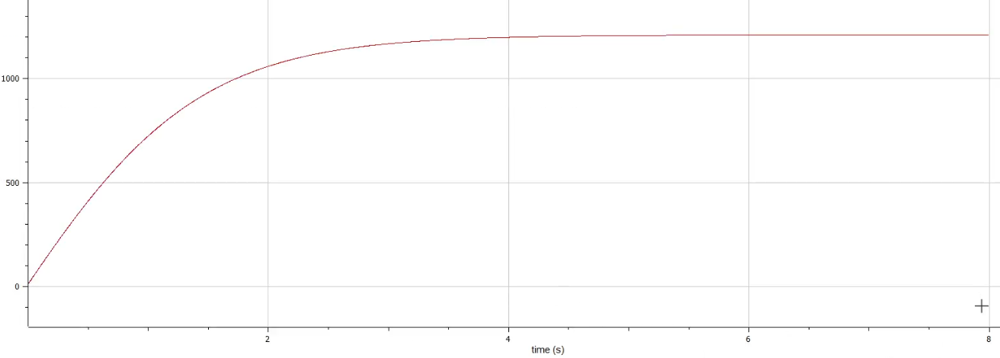
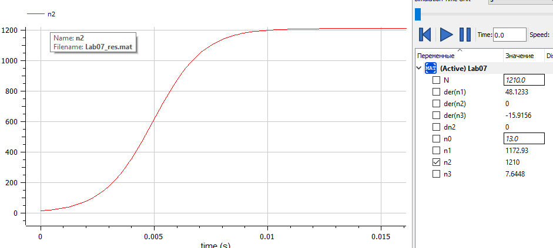
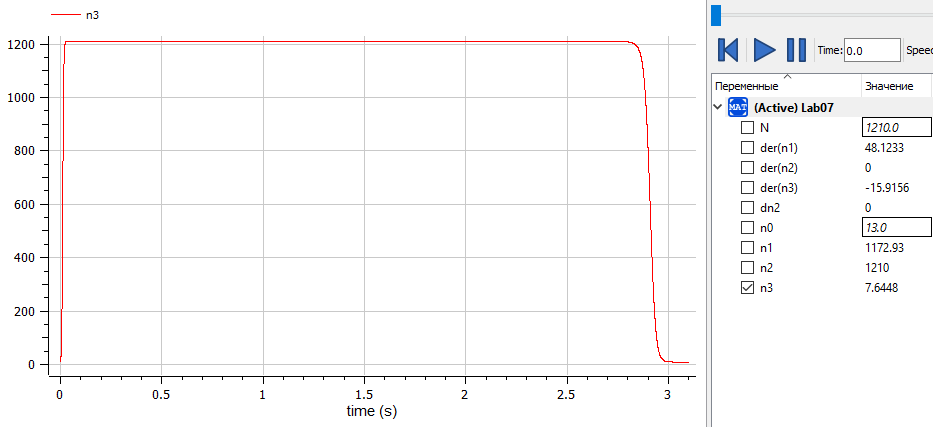
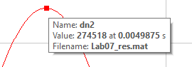

---
# Front matter
title: "Отчет по лаб. работе №7"
subtitle: "Модель эффективности рекламы"
author: "Вейценфельд Даниил Анатольевич"

# Generic otions
lang: ru-RU
toc-title: "Содержание"

# Bibliography
bibliography: cite.bib
csl: ../../pandoc-cfg/GOST-R-7-0-5-2008.csl

# Pdf output format
toc: true # Table of contents
toc_depth: 2
lof: true # List of figures
lot: true # List of tables
fontsize: 12pt
linestretch: 1.5
papersize: a4
documentclass: scrreprt
## I18n
polyglossia-lang:
  name: russian
  options:
	- spelling=modern
	- babelshorthands=true
polyglossia-otherlangs:
  name: english
### Fonts
mainfont: PT Serif
romanfont: PT Serif
sansfont: PT Sans
monofont: PT Mono
mainfontoptions: Ligatures=TeX
romanfontoptions: Ligatures=TeX
sansfontoptions: Ligatures=TeX,Scale=MatchLowercase
monofontoptions: Scale=MatchLowercase,Scale=0.9
## Biblatex
biblatex: true
biblio-style: "gost-numeric"
biblatexoptions:
  - parentracker=true
  - backend=biber
  - hyperref=auto
  - language=auto
  - autolang=other*
  - citestyle=gost-numeric
## Misc options
indent: true
header-includes:
  - \linepenalty=10 # the penalty added to the badness of each line within a paragraph (no associated penalty node) Increasing the value makes tex try to have fewer lines in the paragraph.
  - \interlinepenalty=0 # value of the penalty (node) added after each line of a paragraph.
  - \hyphenpenalty=50 # the penalty for line breaking at an automatically inserted hyphen
  - \exhyphenpenalty=50 # the penalty for line breaking at an explicit hyphen
  - \binoppenalty=700 # the penalty for breaking a line at a binary operator
  - \relpenalty=500 # the penalty for breaking a line at a relation
  - \clubpenalty=150 # extra penalty for breaking after first line of a paragraph
  - \widowpenalty=150 # extra penalty for breaking before last line of a paragraph
  - \displaywidowpenalty=50 # extra penalty for breaking before last line before a display math
  - \brokenpenalty=100 # extra penalty for page breaking after a hyphenated line
  - \predisplaypenalty=10000 # penalty for breaking before a display
  - \postdisplaypenalty=0 # penalty for breaking after a display
  - \floatingpenalty = 20000 # penalty for splitting an insertion (can only be split footnote in standard LaTeX)
  - \raggedbottom # or \flushbottom
  - \usepackage{float} # keep figures where there are in the text
  - \floatplacement{figure}{H} # keep figures where there are in the text
---

# Цель работы

Построить модель эффективности рекламы для трех случаев. Во втором найти 
максимальную скорость роста покупателей.

# Задание

**Вариант №9**

Постройте график распространения рекламы, математическая модель которой описывается следующим уравнением

1. $\frac{dn}{dt} = (0.7 + 0.00051 n(t))(N - n(t))$

2. $\frac{dn}{dt} = (0.00004 + 0.75 (t)n(t))(N - n(t))$

3. $\frac{dn}{dt} = (0.75 sin(0.5t) + 0.35cos(0.6t)n(t))(N - n(t))$

При этом объем аудитории $N = 1210$, в начальный момент о товаре знает $13$ 
человек. Для случая 2 определите в какой момент времени скорость 
распространения рекламы будет иметь максимальное значение.

# Теоретическое введение [1]

Для продажи своей продукции компания запускает рекламную компанию по радио, телевидению и других средств массовой информации. После запуска рекламной кампании информация о продукции начнет распространяться среди потенциальных покупателей путем общения друг с другом.

Математическая модель распространения рекламы описывается уравнением:

$$
\frac{dn}{dt} = (\alpha_1(t) + \alpha_2(t)n(t))(N - n(t))
$$
(1)

где $\frac{dn}{dt}$ - скорость изменения со временем числа потребителей, 
узнавших о товаре и готовых его купить, $t$ - время, прошедшее с начала 
рекламной кампании, $n(t)$ - число уже информированных клиентов, $N$ - общее 
число потенциальных платежеспособных покупателей, $\alpha_1(t) > 0$ - 
характеризует интенсивность рекламной кампании (зависит от затрат на рекламу 
в данный момент времени). Помимо этого, узнавшие о товаре потребители также 
распространяют полученную информацию среди потенциальных покупателей, не 
знающих о нем (в этом случае работает т.н. сарафанное радио). Этот вклад в 
рекламу описывается величиной $\alpha_2(t)n(t)(N-n(t))$.

При $\alpha_1(t) >> \alpha_2(t)$ получается модель типа модели Мальтуса. В обратном случае, получаем уравнение логистической кривой.

# Выполнение лабораторной работы

1. Создал новую модель в OpenModelica [2].

2. Построил модель с заданными параметрами [3].
  Эти три модели отражают эффективность рекламы с т.н. "сарафанным" радио.
  ```m
  model Lab07
    parameter Real N = 1210;
    parameter Real n0 = 13; 

    Real n1(start = n0);
    Real n2(start = n0);
    Real n3(start = n0);

  equation

    der(n1) = (0.7 + 0.00051 * n1) * (N - n1);
    
    der(n2) = (0.00004 + 0.75 * n2) * (N - n2);
    
    der(n3) = (0.75 * sin(0.5 * time) + 0.35 * cos(0.6 * time) * n3) * (N - n3);

  end Lab07;
  ```

3. Выполнил симуляцию. Рассмотрел первый случай. (рис. [-@fig:001])

{ #fig:001 width=70% }

4. Рассмотрел второй и третий случаи (рис. [-@fig:002], [-@fig:003]). Во всех 
  трех случаях, графиком является логистическая кривая.

{ #fig:002 width=70% }

{ #fig:003 width=70% }

5. Для находжения максимальной скорости роста покупателей во втором случае, 
  понадобится вывести график производной n2 по времени. Для этого, я вывел
  значение ее производной в отдельную переменную: `dn2 = der(n2);`, хотя мог 
  этого и не делать, а просто вывести график `der(n2)` в колонке справа.
  Чтобы найти точку, в которой рост был максимален, нужно просто найти 
  максимальное значение производной по n2. Вывел ее график и "на глаз" нашел
  максимум в точке $t = 0.0049875$ (рис. [-@fig:004]).

{ #fig:004 width=70% }

# Выводы

Построил модель распространения информации о товаре с учетом платной рекламы и с учетом сарафанного радио. Определил максимальный рост клиентов в одном из случаев.

# Список литературы{.unnumbered}

1. RUDN. Методические пособия по курсу Математическое Моделирование. — 2022.
2. OpenModelica Documentation. — 2022. — Access mode: https://www.openmodelica.org/.
3. Modelica Documentation. — 2022. — Access mode: https://build.openmodelica.org/Documentation/index.html.
