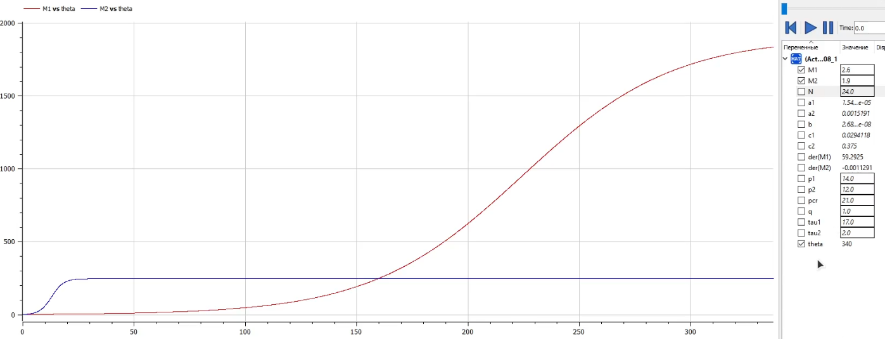
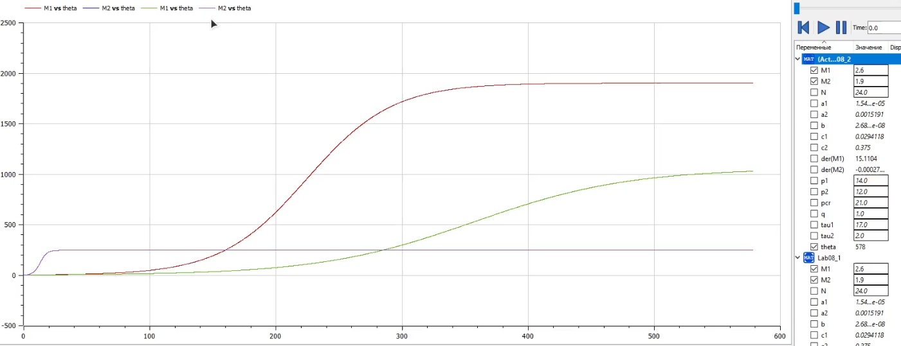

---
# Front matter
title: "Отчет по лаб. работе №8"
subtitle: "Модель конкуренции двух фирм"
author: "Вейценфельд Даниил Анатольевич"

# Generic otions
lang: ru-RU
toc-title: "Содержание"

# Bibliography
bibliography: cite.bib
csl: ../../pandoc-cfg/GOST-R-7-0-5-2008.csl

# Pdf output format
toc: true # Table of contents
toc_depth: 2
lof: true # List of figures
lot: true # List of tables
fontsize: 12pt
linestretch: 1.5
papersize: a4
documentclass: scrreprt
## I18n
polyglossia-lang:
  name: russian
  options:
	- spelling=modern
	- babelshorthands=true
polyglossia-otherlangs:
  name: english
### Fonts
mainfont: PT Serif
romanfont: PT Serif
sansfont: PT Sans
monofont: PT Mono
mainfontoptions: Ligatures=TeX
romanfontoptions: Ligatures=TeX
sansfontoptions: Ligatures=TeX,Scale=MatchLowercase
monofontoptions: Scale=MatchLowercase,Scale=0.9
## Biblatex
biblatex: true
biblio-style: "gost-numeric"
biblatexoptions:
  - parentracker=true
  - backend=biber
  - hyperref=auto
  - language=auto
  - autolang=other*
  - citestyle=gost-numeric
## Misc options
indent: true
header-includes:
  - \linepenalty=10 # the penalty added to the badness of each line within a paragraph (no associated penalty node) Increasing the value makes tex try to have fewer lines in the paragraph.
  - \interlinepenalty=0 # value of the penalty (node) added after each line of a paragraph.
  - \hyphenpenalty=50 # the penalty for line breaking at an automatically inserted hyphen
  - \exhyphenpenalty=50 # the penalty for line breaking at an explicit hyphen
  - \binoppenalty=700 # the penalty for breaking a line at a binary operator
  - \relpenalty=500 # the penalty for breaking a line at a relation
  - \clubpenalty=150 # extra penalty for breaking after first line of a paragraph
  - \widowpenalty=150 # extra penalty for breaking before last line of a paragraph
  - \displaywidowpenalty=50 # extra penalty for breaking before last line before a display math
  - \brokenpenalty=100 # extra penalty for page breaking after a hyphenated line
  - \predisplaypenalty=10000 # penalty for breaking before a display
  - \postdisplaypenalty=0 # penalty for breaking after a display
  - \floatingpenalty = 20000 # penalty for splitting an insertion (can only be split footnote in standard LaTeX)
  - \raggedbottom # or \flushbottom
  - \usepackage{float} # keep figures where there are in the text
  - \floatplacement{figure}{H} # keep figures where there are in the text
---

# Цель работы

Построить графики оборотных средств двух фирм без учета потоянных
издержек и с введенной нормировкой для двух случаев.

# Задание

**Вариант №9**

***Случай 1***. Рассмотрим две фирмы, производящие взаимозаменяемые товары
одинакового качества и находящиеся в одной рыночной нише. Считаем, что в рамках
нашей модели конкурентная борьба ведётся только рыночными методами. То есть,
конкуренты могут влиять на противника путем изменения параметров своего
производства: себестоимость, время цикла, но не могут прямо вмешиваться в
ситуацию на рынке («назначать» цену или влиять на потребителей каким-либо иным
способом.) Будем считать, что постоянные издержки пренебрежимо малы, и в
модели учитывать не будем. В этом случае динамика изменения объемов продаж
фирмы 1 и фирмы 2 описывается следующей системой уравнений:

$$
\begin{aligned}
&\frac{d M_{1}}{d \theta}=M_{1}-\frac{b}{c_{1}} M_{1} M_{2}-\frac{a_{1}}{c_{1}} M_{1}^{2} \\
&\frac{d M_{2}}{d \theta}=\frac{c_{2}}{c_{1}} M_{2}-\frac{b}{c_{1}} M_{1} M_{2}-\frac{a_{2}}{c_{1}} M_{2}^{2}
\end{aligned}
$$

где $a_{1}=\frac{p_{c r}}{\tau_{1}^{2} \tilde{p}_{1}^{2} N q}, a_{2}=\frac{p_{c r}}{\tau_{2}^{2} \tilde{p}_{2}^{2} N q}, b=\frac{p_{c r}}{\tau_{1}^{2} \tilde{p}_{1}^{2} \tau_{2}^{2} \tilde{p}_{2}^{2} N q}, c_{1}=\frac{p_{c r}-\tilde{p}_{1}}{\tau_{1} \tilde{p}_{1}}, c_{2}=\frac{p_{c r}-\tilde{p}_{2}}{\tau_{2} \tilde{p}_{2}}$.
Также введена нормировка $t = c_1 \theta$

***Случай 2***. Рассмотрим модель, когда, помимо экономического фактора
влияния (изменение себестоимости, производственного цикла, использование
кредита и т.п.), используются еще и социально-психологические факторы –
формирование общественного предпочтения одного товара другому, не зависимо от
их качества и цены. В этом случае взаимодействие двух фирм будет зависеть друг
от друга, соответственно коэффициент перед $M_1M_2$
будет отличаться. Пусть в
рамках рассматриваемой модели динамика изменения объемов продаж фирмы 1 и
фирмы 2 описывается следующей системой уравнений:

$$
\begin{aligned}
&\frac{d M_{1}}{d \theta}=M_{1}-\left(\frac{b}{c_{1}}+0,0018\right) M_{1} M_{2}-\frac{a_{1}}{c_{1}} M_{1}^{2} \\
&\frac{d M_{2}}{d \theta}=\frac{c_{2}}{c_{1}} M_{2}-\frac{b}{c_{1}} M_{1} M_{2}-\frac{a_{2}}{c_{1}} M_{2}^{2}
\end{aligned}
$$

Для обоих случаев рассмотрим задачу со следующими начальными условиями и
параметрами:
- $M_0^1 = 2.6, M_0^2 = 1.9$
- $p_{cr} = 21, N = 24, q = 1$
- $\tau_1 = 17, \tau_2 = 2$
- $\tilde{p}_1 = 14, \tilde{p}_2 = 12$

1. Постройте графики изменения оборотных средств фирмы 1 и фирмы 2 без
учета постоянных издержек и с веденной нормировкой для случая 1.
2. Постройте графики изменения оборотных средств фирмы 1 и фирмы 2 без
учета постоянных издержек и с веденной нормировкой для случая 2

# Теоретическое введение [@rudn-matmod:metodics]

## Модель одной фирмы

Для построения модели конкуренции хотя бы двух фирм необходимо
рассмотреть модель одной фирмы. Вначале рассмотрим модель фирмы,
производящей продукт долговременного пользования, когда цена его определяется
балансом спроса и предложения. Примем, что этот продукт занимает
определенную нишу рынка и конкуренты в ней отсутствуют.

Обозначим:
- N – число потребителей производимого продукта.
- S – доходы потребителей данного продукта. Считаем, что доходы всех
  потребителей одинаковы. Это предположение справедливо, если речь идет об
  одной рыночной нише, т.е. производимый продукт ориентирован на определенный
  слой населения.
- M – оборотные средства предприятия
- $\tau$ – длительность производственного цикла
- p – рыночная цена товара
- $\tilde{p}$ – себестоимость продукта, то есть переменные издержки на производство
  единицы продукции.
- $\delta$ – доля оборотных средств, идущая на покрытие переменных издержек.
- $\kappa$ – постоянные издержки, которые не зависят от количества выпускаемой
  продукции.

$Q(S/p)$ – функция спроса, зависящая от отношения дохода S к цене p. Она
равна количеству продукта, потребляемого одним потребителем в единицу
времени.

Функцию спроса товаров долговременного использования часто
представляют в простейшей форме:

$$
Q = q - k \frac{p}{S} = q(1 - \frac{p}{p_{cr}})
$$
(1)

Где q – максимальная потребность одного человека в продукте в единицу времени.
Эта функция падает с ростом цены и при $p = p_{cr}$ (критическая стоимость продукта)
потребители отказываются от приобретения товара. Величина $p_{cr} = Sq/k$.
Параметр k – мера эластичности функции спроса по цене. Таким образом, функция
спроса в форме (1) является пороговой (то есть, $Q(S/p) = 0$ при $p \geq p_{cr}$) и обладает
свойствами насыщения.

Уравнения динамики оборотных средств можно записать в виде

$$
\frac{dM}{dt} = - \frac{M \delta}{\tau} + NQp - \kappa
= - \frac{M \delta}{\tau} + Nq(1 - \frac{p}{p_{cr}})p - \kappa
$$
(2)

Уравнение для рыночной цены p представим в виде

$$
\frac{dp}{dt} = \gamma (- \frac{M \delta}{\tau \tilde{p}} + Nq(1 - \frac{p}{p_{cr}}))
$$
(3)

Первый член соответствует количеству поставляемого на рынок товара (то
есть, предложению), а второй член – спросу.

Параметр $\gamma$ зависит от скорости оборота товаров на рынке. Как правило,
время торгового оборота существенно меньше времени производственного цикла $\tau$.

При заданном M уравнение (3) описывает быстрое стремление цены к
равновесному значению цены, которое устойчиво.
В этом случае уравнение (3) можно заменить алгебраическим соотношением

$$
- \frac{M \delta}{\tau \tilde{p}} + Nq(1 - \frac{p}{p_{cr}}) = 0
$$
(4)

Из (4) следует, что равновесное значение цены p равно

$$
p = p_{cr} (1 - \frac{M \delta}{\tau \tilde{p} Nq})
$$
(5)

Уравнение (2) с учетом (5) приобретает вид

$$
\frac{dM}{dt} = M \frac{\delta}{\tau}(\frac{p_{cr}}{\tilde{p}} - 1) 
- M^2(\frac{\delta}{\tau \tilde{p}})^2 \frac{p_{cr}}{Nq} - \kappa
$$
(6)

Уравнение (6) имеет два стационарных решения, соответствующих
условию $dM/dt = 0$:

$$
\tilde{M}_{1,2} = \frac{1}{2} a \pm \sqrt{\frac{a^2}{4} - b}
$$
(7)

где

$$
a = Nq(1 - \frac{\tilde{p}}{p_{cr}}) \tilde{p} \frac{\tau}{\delta},
b = \kappa Nq \frac{(\tau \tilde{p})^2}{p_{cr} \delta^2} 
$$
(8)

Из (7) следует, что при больших постоянных издержках (в случае $a^2 < 4b$)
стационарных состояний нет. Это означает, что в этих условиях фирма не может
функционировать стабильно, то есть, терпит банкротство. Однако, как правило,
постоянные затраты малы по сравнению с переменными (то есть, $b \ll a^2$) и играют
роль, только в случае, когда оборотные средства малы. При $b \ll a$ стационарные
значения M равны

$$
\tilde{M}_+ = Nq \frac{\tau}{\delta}(1 - \frac{\tilde{p}}{p_{cr}})\tilde{p},
\tilde{M}_- = \kappa \tilde{p} \frac{\tau}{\delta(p_{cr} - \tilde{p})}
$$
(9)

Первое состояние $\tilde{M}_+$ устойчиво и соответствует стабильному
функционированию предприятия. Второе состояние
$\tilde{M}_-$ неустойчиво, так, что при
$M < \tilde{M}_-$
оборотные средства падают ($dM/dt < 0$), то есть, фирма идет к
банкротству. По смыслу $\tilde{M}_-$
соответствует начальному капиталу, необходимому
для входа в рынок.
В обсуждаемой модели параметр $\delta$ всюду входит в сочетании с $\tau$. Это значит,
что уменьшение доли оборотных средств, вкладываемых в производство,
эквивалентно удлинению производственного цикла. Поэтому мы в дальнейшем
положим: $\delta = 1$, а параметр $\tau$ будем считать временем цикла, с учётом сказанного.

## Конкуренция двух фирм

***Случай 1***

Рассмотрим две фирмы, производящие взаимозаменяемые товары
одинакового качества и находящиеся в одной рыночной нише. Последнее означает,
что у потребителей в этой нише нет априорных предпочтений, и они приобретут
тот или иной товар, не обращая внимания на знак фирмы.

В этом случае, на рынке устанавливается единая цена, которая определяется
балансом суммарного предложения и спроса. Иными словами, в рамках нашей
модели конкурентная борьба ведётся только рыночными методами. То есть,
конкуренты могут влиять на противника путем изменения параметров своего
производства: себестоимость, время цикла, но не могут прямо вмешиваться в
ситуацию на рынке («назначать» цену или влиять на потребителей какимлибо иным способом.)

Уравнения динамики оборотных средств запишем по аналогии с (2) в виде

$$
\begin{aligned}
&\frac{d M_{1}}{d t}=-\frac{M_{1}}{\tau_{1}}+N_{1} q\left(1-\frac{p}{p_{c r}}\right) p-\kappa_{1} \\
&\frac{d M_{2}}{d t}=-\frac{M_{2}}{\tau_{2}}+N_{2} q\left(1-\frac{p}{p_{c r}}\right) p-\kappa_{2}
\end{aligned}
$$
(10)

где использованы те же обозначения, а индексы 1 и 2 относятся к первой и второй фирме, 
соответственно. Величины $N_{1}$ и $N_{2}$ - числа потребителей, приобретших товар первой и второй фирмы.

Учтем, что товарный баланс устанавливается быстро, то есть, произведенный каждой фирмой 
товар не накапливается, а реализуется по цене $p$. Тогда

$$
\begin{aligned}
&\frac{M_{1}}{\tau_{1} \tilde{p}_{1}}=N_{1} q\left(1-\frac{p}{p_{c r}}\right) \\
&\frac{M_{2}}{\tau_{2} \tilde{p}_{2}}=N_{2} q\left(1-\frac{p}{p_{c r}}\right)
\end{aligned}
$$
(11)

где $\tilde{p}_{1}$ и $\tilde{p}_{2}-$ себестоимости товаров в первой и второй фирме.

С учетом (10) представим (11) в виде 

$$
\begin{aligned}
&\frac{d M_{1}}{d t}=-\frac{M_{1}}{\tau_{1}}\left(1-\frac{p}{\tilde{p}_{1}}\right)-\kappa_{1} \\
&\frac{d M_{2}}{d t}=-\frac{M_{2}}{\tau_{2}}\left(1-\frac{p}{\tilde{p}_{2}}\right)-\kappa_{2}
\end{aligned}
$$
(12)

Уравнение для цены, по аналогии с (3),

$$
\frac{d p}{d t}=-\gamma\left(\frac{M_{1}}{\tau_{1} \tilde{p}_{1}}+\frac{M_{2}}{\tau_{2} \tilde{p}_{2}}-N q\left(1-\frac{p}{p_{c r}}\right)\right)
$$
(13)

Считая, как и выше, что ценовое равновесие устанавливается быстро, получим:

$$
p=p_{c r}\left(1-\frac{1}{N q}\left(\frac{M_{1}}{\tau_{1} \tilde{p}_{1}}+\frac{M_{2}}{\tau_{2} \tilde{p}_{2}}\right)\right)
$$
(14)

Подставив (14) в (12) имеем:

$$
\begin{aligned}
&\frac{d M_{1}}{d t}=c_{1} M_{1}-b M_{1} M_{2}-a_{1} M_{1}^{2}-\kappa_{1} \\
&\frac{d M_{2}}{d t}=c_{2} M_{2}-b M_{1} M_{2}-a_{2} M_{2}^{2}-\kappa_{2}
\end{aligned}
$$
(15)

где

$$
a_{1}=\frac{p_{c r}}{\tau_{1}^{2} \tilde{p}_{1}^{2} N q}, a_{2}=\frac{p_{c r}}{\tau_{2}^{2} \tilde{p}_{2}^{2} N q}, b=\frac{p_{c r}}{\tau_{1}^{2} \tilde{p}_{1}^{2} \tau_{2}^{2} \tilde{p}_{2}^{2} N q}, c_{1}=\frac{p_{c r}-\tilde{p}_{1}}{\tau_{1} \tilde{p}_{1}}, c_{2}=\frac{p_{c r}-\tilde{p}_{2}}{\tau_{2} \tilde{p}_{2}}
$$
(16)

Исследуем систему (15) в случае, когда постоянные издержки (к $\left.1, \kappa_{2}\right)$ пренебрежимо малы. И введем нормировку $t=c_{1} \theta$. Получим следующую систему:

$$
\begin{aligned}
&\frac{d M_{1}}{d \theta}=M_{1}-\frac{b}{c_{1}} M_{1} M_{2}-\frac{a_{1}}{c_{1}} M_{1}^{2} \\
&\frac{d M_{2}}{d \theta}=\frac{c_{2}}{c_{1}} M_{2}-\frac{b}{c_{1}} M_{1} M_{2}-\frac{a_{2}}{c_{1}} M_{2}^{2}
\end{aligned}
$$
(17)

Чтобы решить систему (17) необходимо знать начальные условия. Зададим начальные значения $M_{0}^{1}=2, M_{0}^{2}=1$ и известные параметры: $p_{c r}=20, \tau_{1}=10$, $\tau_{2}=16, \tilde{p}_{1}=9, \tilde{p}_{2}=7, N=10, q=1 .$

Замечание: Необходимо учесть, что значения $p_{c r}, \tilde{p}_{1,2}, N$ указаны в тысячах единиц (например $N=10$ - означает 10000 потенциальных потребителей), а значения $M_{1,2}$ указаны в млн. единиц.

Рост оборотных средств предприятий идет независимо друг от друга. В математической модели (17) этот факт отражается в коэффициенте, стоящим перед членом $M_{1} M_{2}$: в рассматриваемой задаче он одинаковый в обоих уравнениях $\left(\frac{b}{c_{1}}\right)$. Это было обозначено в условиях задачи. Каждая фирма достигает свое максимальное значение объема продаж и остается на рынке с этим значением, то есть каждая фирма захватывает свою часть рынка потребителей, которая не изменяется.

***Случай 2***

Рассмотрим модель, когда, помимо экономического фактора влияния (изменение себестоимости, производственного цикла, использование
кредита и т.п.), используются еще и социально-психологические факторы - формирование общественного предпочтения одного товара 
другому, не зависимо от их качества и цены. В этом случае взаимодействие двух фирм будет зависеть друг от друга, соответственно 
коэффициент перед $M_{1} M_{2}$ будет отличаться.

Рассмотрим следующую модель: 

$$
\begin{aligned}
&\frac{d M_{1}}{d \theta}=M_{1}-\left(\frac{b}{c_{1}}+0,002\right) M_{1} M_{2}-\frac{a_{1}}{c_{1}} M_{1}^{2} \\
&\frac{d M_{2}}{d \theta}=\frac{c_{2}}{c_{1}} M_{2}-\frac{b}{c_{1}} M_{1} M_{2}-\frac{a_{2}}{c_{1}} M_{2}^{2}
\end{aligned}
$$
(18)

Начальные условия и известные параметры остаются прежними. В этом случае первая фирма, несмотря на начальный рост, 
достигнув своего максимального объема продаж, начитает нести убытки и, в итоге, терпит банкротство. 
Динамика роста объемов оборотных средств второй фирмы остается без изменения: достигнув максимального 
значения, остается на этом уровне.

Замечание: Стоит отметить, что рассматривается упрощенная модель, которая дает модельное решение.
В реальности факторов, влияющих на динамику изменения оборотных средств предприятий, больше.

# Выполнение лабораторной работы

1. Создал новую модель в OpenModelica [@modelica-doc:openmodelica].

2. Построил модель с заданными параметрами [@modelica-doc:modelica] (для первого случая).
  
  ```m
  model Lab08_1
    parameter Real N = 24 "Целевое число потребителей";
    parameter Real pcr = 21 "Критическая стоимость продукта";
    parameter Real q = 1 "Макс. потребность одного человека";
    parameter Real tau1 = 17 "(1) Длительность производственного цикла";
    parameter Real tau2 = 2 "(2) Длительность производственного цикла";
    parameter Real p1 = 14 "(1) Себестоимость продукта";
    parameter Real p2 = 12 "(2) Себестоимость продукта";

    parameter Real a1 = pcr / (tau1^2 * p1^2 * N * q);
    parameter Real a2 = pcr / (tau2^2 * p2^2 * N * q);
    parameter Real b = pcr / (tau1^2 * p1^2 * tau2^2 * p2^2 * N * q);
    parameter Real c1 = (pcr - p1) / (tau1 * p1);
    parameter Real c2 = (pcr - p2) / (tau2 * p2);
    
    Real theta;
    Real M1(start = 2.6) "(1) Оборотные средства";
    Real M2(start = 1.9) "(2) Оборотные средства";

  equation

    der(M1) = M1 - M1 * M2 * b / c1 - M1^2 * a1 / c1;
    der(M2) = M2 * c2 / c1 - M1 * M2 * b / c1 - M2^2 * a2 / c1;
    
    theta = time / c1;
  end Lab08_1;
  ```

3. Выполнил симуляцию. (рис. [-@fig:001]).
  Поскольку у нас время нормировано (`theta = time / c1`), будем смотреть график по `theta`.

{ #fig:001 width=100% }

Фирма 1 обогнала фирму 2 в точке $theta \ 159.49$

4. Построил модель для случая 2:
    ```m
  model Lab08_2
    parameter Real N = 24 "Целевое число потребителей";
    parameter Real pcr = 21 "Критическая стоимость продукта";
    parameter Real q = 1 "Макс. потребность одного человека";
    parameter Real tau1 = 17 "(1) Длительность производственного цикла";
    parameter Real tau2 = 2 "(2) Длительность производственного цикла";
    parameter Real p1 = 14 "(1) Себестоимость продукта";
    parameter Real p2 = 12 "(2) Себестоимость продукта";

    parameter Real a1 = pcr / (tau1^2 * p1^2 * N * q);
    parameter Real a2 = pcr / (tau2^2 * p2^2 * N * q);
    parameter Real b = pcr / (tau1^2 * p1^2 * tau2^2 * p2^2 * N * q);
    parameter Real c1 = (pcr - p1) / (tau1 * p1);
    parameter Real c2 = (pcr - p2) / (tau2 * p2);
    
    Real theta;
    Real M1(start = 2.6) "(1) Оборотные средства";
    Real M2(start = 1.9) "(2) Оборотные средства";

  equation

    der(M1) = M1 - M1 * M2 * (b / c1 + 0.0018) - M1^2 * a1 / c1;
    der(M2) = M2 * c2 / c1 - M1 * M2 * b / c1 - M2^2 * a2 / c1;
    
    theta = time / c1;
  end Lab08_2;
  ```

5. Выполнил симуляцию. Вывел графики первого случая и второго. (рис. [-@fig:002]).
  Видно, что график второй фирмы не изменился, т.к. мы не меняли ее коэффициент
  зависимости от первой, а первая стала расти дольше, чем в предыдущем случае.

{ #fig:002 width=100% }

# Выводы

Построил модель конкуренции двух фирм для двух случаев.

# Список литературы{.unnumbered}

