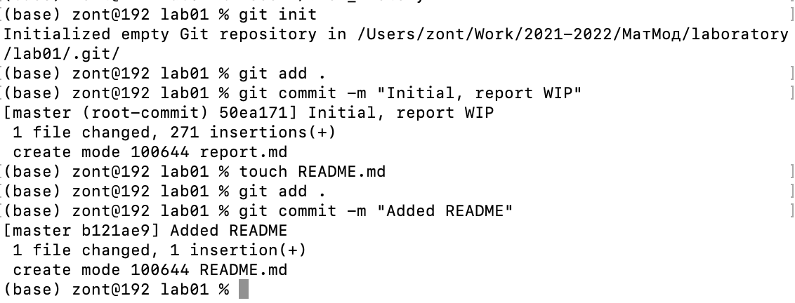
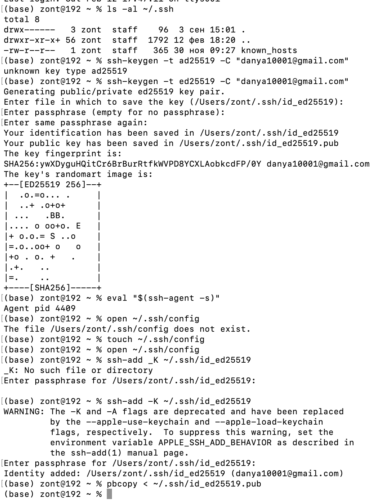
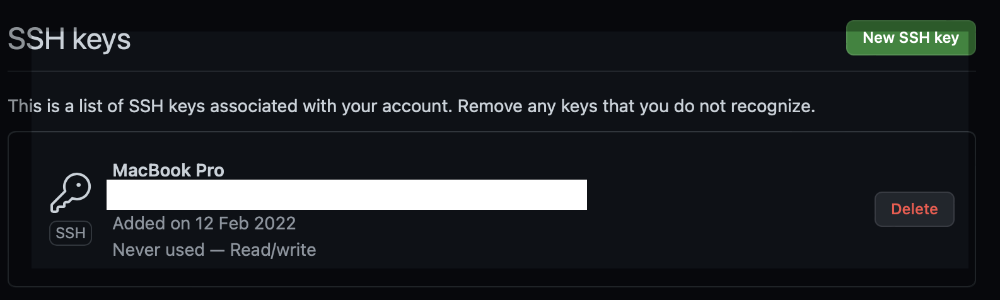
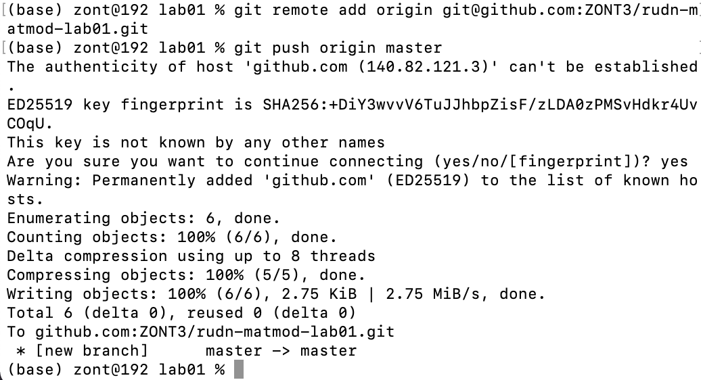

# Цель работы

Познакомиться с работой git и Markdown.
Изучить основные принципы работы с репозиториями в системе контроля версий
git.
Научиться пользоваться разметкой Markdown. Подготовить отчет о выполнении
данной лабораторной работы, используюя Markdown.

# Задание

- Создать git-репозиторий
- Выполнить необходимые операции с репозиторием
- Сделать отчет по лабораторной работе в формате Markdown
- Сконвертировать формат Markdown в PDF и DOCX

# Теоретическое введение

Git - система контроля версий. Позволяет работать над одним проектом
нескольким людям, предоставляя возможность отслеживать версии и изменения.
Markdown - формат разметки текста, основная идея которого - сделать
удобным написание "вручную", а так же иметь читабельный вид даже
при просмотре исходного файла (без форматирования)

# Выполнение лабораторной работы

## Подготовка

Использовал следующие команды для настройки конфига git:
`git config --global user.name "ZONT3"`
`git config --global user.email "danya10001@gmail.com"`
`git config --global core.autocrlf input`
`git config --global core.safecrlf true`
`git config --global core.quotepath off`

Создал директории для работы

```
mkdir -p "Work/2021-2022/Ѓ<BC>атЃ<BC>од/laboratory/lab01"
cd Work/2021-2022/Ѓ<BC>атЃ<BC>од/laboratory
mkdir temp
cd temp
mkdir hello
cd hello
```

Создал файл `hello.html` для экспериментов над ним

## Работа с git

Создал репозиторий, добавил в него файл и сделал коммит

```
git init
git add hello.html
git commit -m "Initial"
git status
```

Сделал еще коммитов

```
git add hello.html
git commit -m "Added standard HTML tags"
git status
git add .
git commit -m "Added Header"
git status
```

Изучил перемещение по коммитам и создание тэгов

```
git checkout 26682e2798f3e872f7e3659ba98de8461615b809
git checkout master
git tag v1
git tag v1^
git checkout v1^
git tag v1-beta
git checkout v1
git checkout v1-beta
git tag
git log --pretty=oneline
git checkout v1
git log --pretty=oneline
git checkout master
```

Изучил `git reset` и `git revert`

```
git add .
git status
git reset HEAD hello.html
git checkout hello.html
git add .
git status
git add .
git status
git reset HEAD hello.html
git status
git checkout hello.html
git checkout hello.html
git checkout .
git checkout *
git checkout hello.html
git checkout .
git add .
git commit -m "A bad commit"
git revert HEAD
git log
git log --pretty=oneline
git checkout HEAD^
git tag oops
git checkout master
git log --pretty=oneline
git reset --hard v1
git log --pretty=oneline
git log --all
git tag -d oops
git log --all
git commit -m "Added author comment"
git add .
git commit -m "Added author comment"
git add .
git commit --amend -m "Added author/email comment"
git log --pretty=oneline
```

Изучил структуру `.git`

```
git log --pretty=oneline
git cat-file -t 4e396969aef1db9439ed969f8f91cf587c9c9d7d
git cat-file -p 4e396969aef1db9439ed969f8f91cf587c9c9d7d
git log --max-count=1
git cat-file -p 64aab16521857481798b3120981c65ef15c0d62c
git cat-file -p 9690c621da2fbe3bccce98f78549c6409fe3fba1
git cat-file -p 3056f2a2c02cef5c9aa039f7e6f4a240b7e79beb
git cat-file -p 9bde3369933772920ad2b169b10c2a3324d8cec9
git cat-file -p 523cd318fc3b74ad3852cd34a74720ad6f7dd422
git cat-file -p 8ab686eafeb1f44702738c8b0f24f2567c36da6d
git cat-file -p dd2c0f355961fb148567f05a5fa856b0c723c3f3
```

Изучил работу с ветвями

```
mkdir lib
mv hello.html lib/hello.html
git status
mv lib/hello.html .
git mv hello.html lib/hello.html
git status
git checkout master
git checkout .
git revert HEAD
git revert --hard HEAD
git reset --hard HEAD
mkdir lib
mv hello.html lib
git add lib/hello.html
git status
git rm .
git add .
git status
git commit -m "Moved hello.html to lib"
touch index.html
git add .
git commit -m "Added index.html"
ls .git
git checkout -b style
git status
touch lib/style.css
git add .
git commit -m "Added stylesheet"
git commit --amend -m "Added stylesheet"
git commit -m "Updated index.html"
git add .
git reset --hard HEAD
git add lib/hello.html
git commit --amend -m "Added stylesheet"
git add .
git commit -m "Updated index.html"
git log --pretty=oneline
git checkout master
git log --pretty=oneline
git checkout style
git checkout master
touch README.dm
mv README.dm README.md
git add .
git commit README.md
git log --pretty=oneline
git log --greph --all
git log --graph --all
git checkout style
git merge master
git log --graph --all
git checkout master
git log --graph --all
git add .
git commit -m "Life is great"
git commit -m "Life is great"
git log --graph --all
git checkout style
git merge master
git status
git commit
git add .
git commit
git log --graph --all
git log --graph --all
git checkout style
git reset --hard 9acb42f14928242da6e6ee0463e69af8afb73418
git log --graph --all
git checkout master
git log --graph
git log --graph --all
git reset --hard fbb5881592fefd8503f5817ec52fe8d240d08e85
git log --graph
git log --graph --all
git checkout style
git rebase master
git log --graph --all
git checkout master
git merge style
git log --graph --all
```

Изучил клонирование и удаленные ветки

```
cd ..
git clone hello cloned_hello
cd cloned_hello
git log
git remote show origin
git branch
git branch -a
cd ../hello
git add .
git commit -m "Changed README in original repo"
cd ../cloned_hello
git fetch
git log
git log --all
git pull
git branch --track style origin/style
git branch -a
cd ..
git clone --bare hello hello.gin
mv hello.gin hello.git
cd hello
git remote add shared ../hello.git
git add .
git commit -m "Added shared comment to readme"
git push shared master
cd ../cloned_hello
git remote add shared ../hello.git
git branch --track shared master
git pull shared master
git log --all
```

## Оформление в Markdown

1. Создал в папке `lab01` файл `report.md`, в котором пишу отчет
2. Создал здесь же файл `README.md` для описания будущего репозитория
3. Инициализировал репозиторий, сделал коммиты 
4. Создал SSH-ключ
    
    
5. Сделал `push` 
6. Дописал отчет и залил на github.

# Выводы

Ознакомился с `git`, `GitHub` и `Markdown`.
Научился пользоваться разметкой `Markdown`
Научился использовать `git`, его ветки и такие команды,
как `add`, `commit`, `checkout`, `branch`, `reset`, `revert`, `remote`, `merge`
